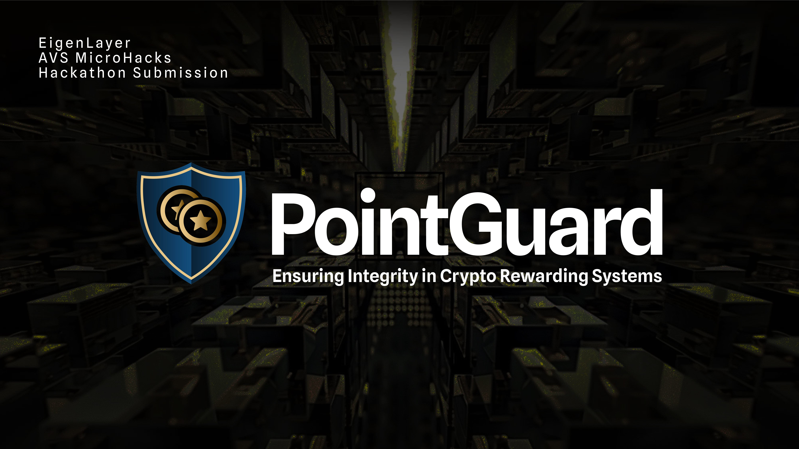
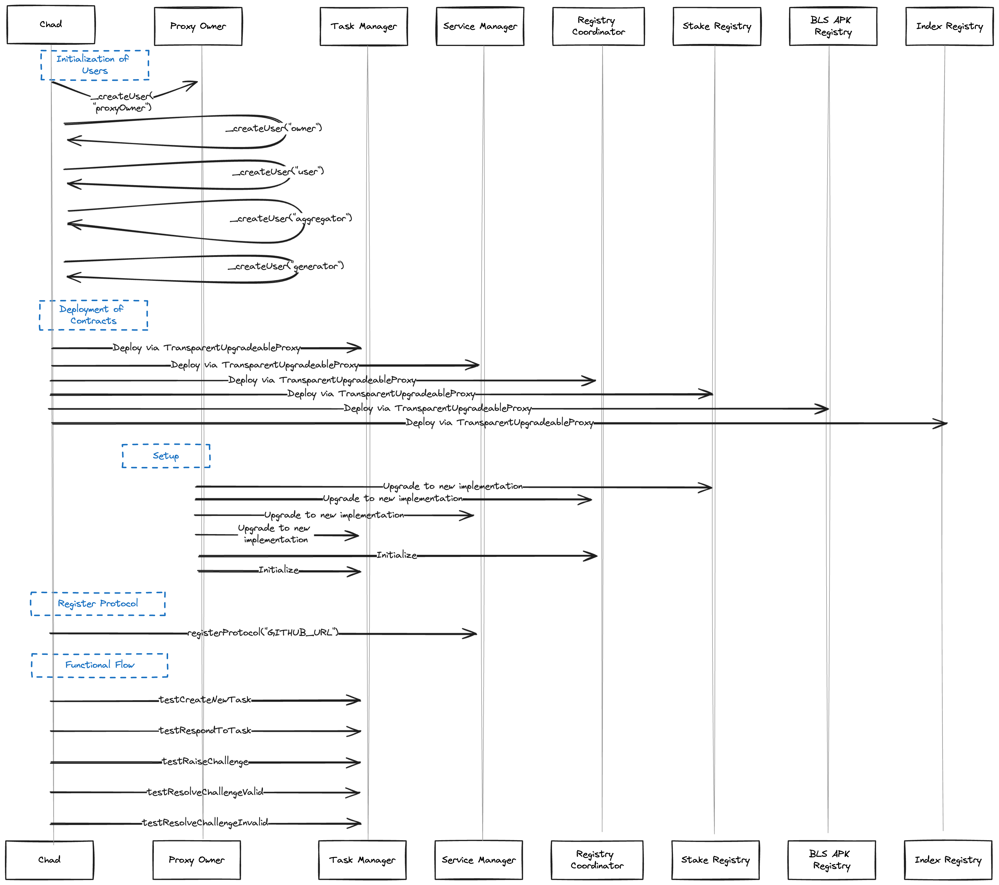

## PointGuard

PointGuard is a protocol points system that is validated by an Active Validator Service (AVS) powered by EigenLayer.

The AVS listens to ERC20 or ERC721 contracts and calculates reward points for users. These contracts interface with EigenLayer to ensure that the points awarded to users have been deterministically calculated.

### Features

- **Automated Points Calculation**: Automatically calculates reward points based on user interactions with ERC20 or ERC721 contracts.
- **Restaking Validation**: Utilizes restaking operators to ensure the integrity and accuracy of the points system.
- **Integration with Eigen Layer**: Leverages EigenLayer for deterministic validation of points, ensuring transparency and trustworthiness.

### Use Cases

- **Loyalty Programs**: Implement a loyalty rewards system based on user interactions with your platform.
- **Gaming**: Reward players with points for in-game achievements and activities.
- **DeFi Platforms**: Incentivize users for participating in decentralized finance activities.

### Technical Overview

**Contracts**

The contracts have been forked directly from the incredible squaring example. For calculating the protocol rewards points, the avs operator service is run and tasks are submitted to the Task Manager. Currently, the Aggregator has not been implemented yet, and the task submission flow has not been connected to the AVS service.

Contracts Demo: https://www.loom.com/share/0bf11453e7bb4bb49dbf45db25f62a31?sid=95a78a90-a228-45d2-8ab9-f6f8cca62db8

**Operator Service**

The Operator service is a protocl indexing service that calculates points a user has accrued based on ERC20 or ERC721 Transfer events. The configuration is flexible to handle other contract types, but our thinking is Tokens would be enough to start.

The rewards are caluclated at 2 Points per hour and served with GraqphQL using an indexing framework called Ponder.

**Note to AVS Hack Judges**

We are currently building our mainnet LRT protocol and didn't have a lot of time to allocate to this AVS hack. However, we are going to continue building this project becauses it's important to us. We look forward to collaborating with Eigen and the ecosystem on a more fair and trustworthy protocol points standard based on AVS technology.

